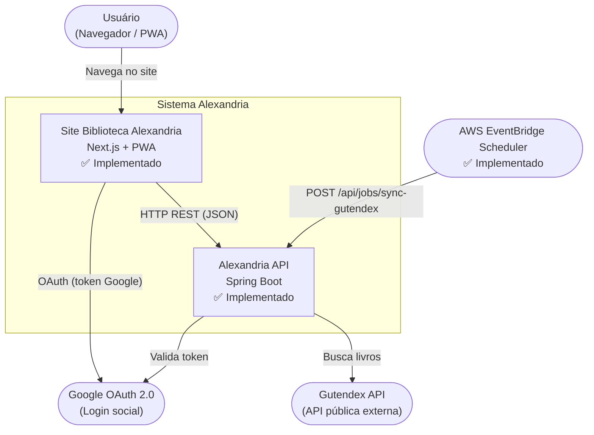
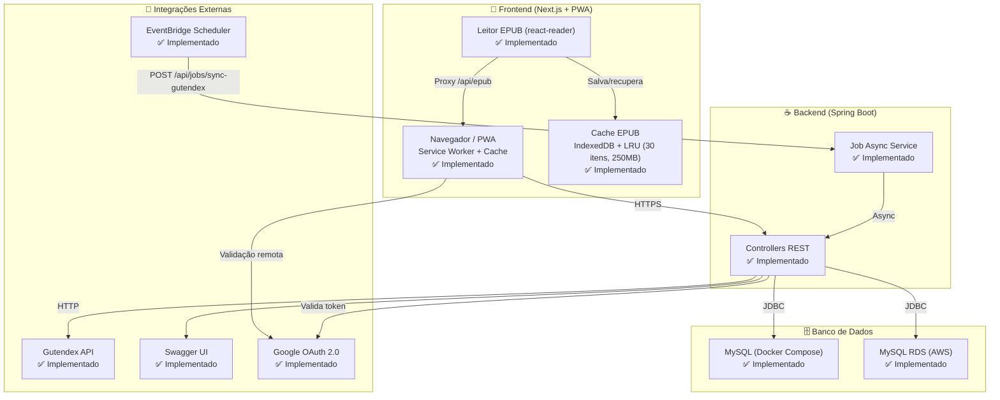
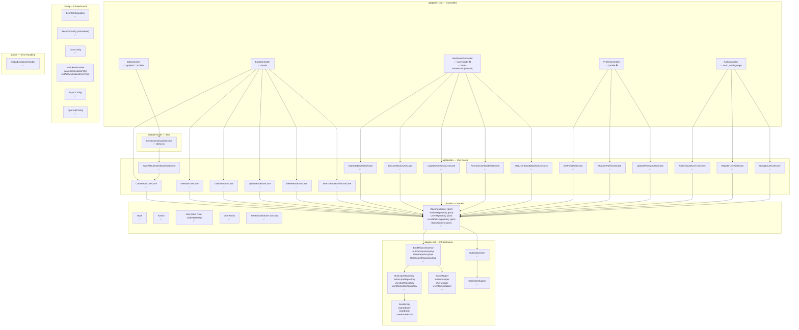

# 🏗️ C4 Model — Alexandria

> **Legenda:** ✅ Implementado | 🔧 Parcialmente implementado | 📋 Plano (não implementado)

---

## Nível 1 — Context (System Context)

---

## Nível 2 — Container

---

## Nível 3 — Component (Backend)

---

## Nível 3 — Component (Frontend)

```mermaid
graph TB
    subgraph "📱 Páginas (Next.js App Router)"
        HOME["/ (redireciona → /explorar)<br/>✅ page.tsx"]
        LOGIN["/login<br/>✅ page.tsx"]
        REGISTER["/registrar<br/>✅ page.tsx"]
        EXPLORE["/explorar<br/>✅ page.tsx (com busca e top books)"]
        BOOK_DETAIL["/explorar/[id]<br/>✅ page.tsx (add to library + leitor link)"]
        BIBLIOTECA["/biblioteca<br/>✅ page.tsx (filtros, progresso, remoção)"]
        LEITOR["/leitor<br/>✅ page.tsx (placeholder estático)"]
        LEITOR_ID["/leitor/[id]<br/>✅ page.tsx (react-reader + progresso real)"]
        DASHBOARD["/dashboard<br/>✅ page.tsx (stats reais da API)"]
        EMPRESTIMOS["/emprestimos<br/>✅ page.tsx (mock estático)"]
        CONFIG["/configuracoes<br/>✅ page.tsx (perfil + senha reais)"]
        SUPORTE["/suporte<br/>✅ page.tsx (FAQ + contato)"]
    end

    subgraph "🧩 Componentes"
        BOOK_CARD["BookCard<br/>✅"]
        SIDEBAR["Sidebar<br/>✅"]
        HEADER["Header / MobileHeader<br/>✅"]
        BOTTOM_NAV["BottomNav<br/>✅"]
        LOGIN_MODAL["LoginModal<br/>✅ (modal de login com Google)"]
        AUTH_MODAL_TRIGGER["AuthModalTrigger<br/>✅ (?auth=1)"]
        GOOGLE_PROVIDER["GoogleProvider<br/>✅ (GoogleOAuthProvider)"]
        SERVICE_WORKER["ServiceWorkerRegister<br/>✅ (PWA)"]
    end

    subgraph "🔧 Contextos"
        AUTH_CTX["AuthContext<br/>✅ (login, logout, loginWithGoogle, updateUsername)"]
        AUTH_MODAL_CTX["AuthModalContext<br/>✅ (modal login tracking)"]
    end

    subgraph "📡 API Layer"
        API_LIB["api.ts<br/>✅ login, register, loginWithGoogle,<br/>getBooks, searchBooks, getBookById,<br/>addUserBook, getUserBooks, updateUserBook,<br/>removeUserBook, getProfile, updateProfile,<br/>updatePassword, getTopBooks, apiFetch"]
        PROXY["proxy.ts<br/>✅"]
        EPUB_ROUTE["/api/epub/route.ts<br/>✅ proxy download EPUB"]
    end

    subgraph "📚 Hooks / Utilitários"
        USE_EPUB["useEpub<br/>✅ (cache + IndexedDB)"]
        EPUB_CACHE["epub-cache<br/>✅ (LRU + IndexedDB)"]
    end

    subgraph "📁 Dados Mockados"
        BOOKS_DATA["data/books.ts<br/>✅ (mock estático p/ leitor sem API)"]
    end

    EXPLORE --> BOOK_CARD
    BIBLIOTECA --> BOOK_CARD
    AUTH_CTX --> API_LIB
    LOGIN --> API_LIB
    REGISTER --> API_LIB
    EXPLORE --> API_LIB
    BIBLIOTECA --> API_LIB
    CONFIG --> API_LIB
    DASHBOARD --> API_LIB
    BOOK_DETAIL --> API_LIB
    LEITOR_ID --> USE_EPUB
    LEITOR_ID --> API_LIB
    USE_EPUB --> EPUB_CACHE
    USE_EPUB --> EPUB_ROUTE
    LOGIN --> AUTH_CTX
    REGISTER --> AUTH_CTX
    LOGIN_MODAL --> AUTH_CTX
    LOGIN_MODAL --> AUTH_MODAL_CTX
    AUTH_MODAL_TRIGGER --> AUTH_MODAL_CTX
    BOOK_DETAIL --> AUTH_MODAL_CTX
```

---

## 📋 Planos (Não Implementados)

### 🔮 Autenticação Seletiva
✅ **Implementado!** A segurança por roles foi aplicada:

| Endpoint | Hoje |
|---|---|
| `GET /books/**` | ✅ Público |
| `POST /books` | 🔒 **ROLE_ADMIN** |
| `PUT /books/{id}` | 🔒 **ROLE_ADMIN** |
| `DELETE /books/{id}` | 🔒 **ROLE_ADMIN** |
| `POST /api/jobs/sync-gutendex` | 🔒 **ROLE_ADMIN** |
| `/user-books/**` | 🔒 Autenticado |
| `/profile/**` | 🔒 Autenticado |

---

### 🔮 Flyway em Produção (pós-MVP)
| O que | Status |
|---|---|
| Migrations V0, V001, V002 | ✅ Código pronto |
| Flyway ativo no RDS | 📋 **Aguardando pós-MVP** |
| Migration V003 (schema atual) | 📋 **Precisa ser criada** |

---

## ✅ Resumo Geral

| Componente | Implementado | Em Plano |
|---|---|---|
| **Backend** — Domain, Application, Adapters | ✅ 100% | — |
| **Backend** — Controllers REST | ✅ 5 controllers (Auth, Book, UserBooks, Job, Profile) | — |
| **Backend** — Google OAuth | ✅ | — |
| **Backend** — Profile (GET/PUT /profile/me, PUT /profile/password) | ✅ | — |
| **Backend** — Security (Role-based: ADMIN x USER) | ✅ | — |
| **Backend** — Job Sincronização | ✅ | — |
| **Backend** — Flyway | ✅ Migrações | 📋 Ativar pós-MVP |
| **Backend** — Swagger | ✅ | Ajustes finos |
| **Backend** — Testes | ✅ | — |
| **Frontend** — Páginas | ✅ 12 páginas (incl. leitor real com react-reader) | — |
| **Frontend** — Leitor EPUB com cache (IndexedDB + LRU) | ✅ | — |
| **Frontend** — Login modal com Google OAuth | ✅ | — |
| **Frontend** — PWA (Service Worker + Manifest) | ✅ | — |
| **Frontend** — Dashboard com stats reais | ✅ | — |
| **Frontend** — Biblioteca com filtros, progresso e remoção | ✅ | — |
| **Frontend** — Configurações (perfil e senha reais) | ✅ | — |
| **Frontend** — API integration | ✅ | — |
| **Infra** — Docker (local) | ✅ | — |
| **Infra** — Docker (AWS) | ✅ | — |
| **Infra** — CI/CD (.github) | ⚠️ Apenas hooks | 📋 GitHub Actions |
| **Infra** — AWS EventBridge | ✅ | — |
