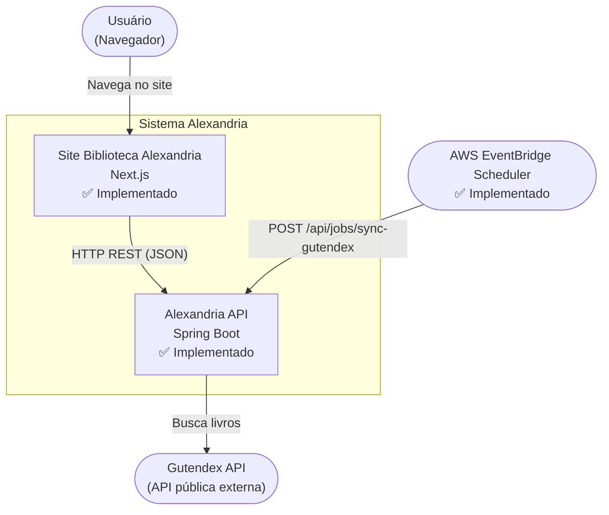
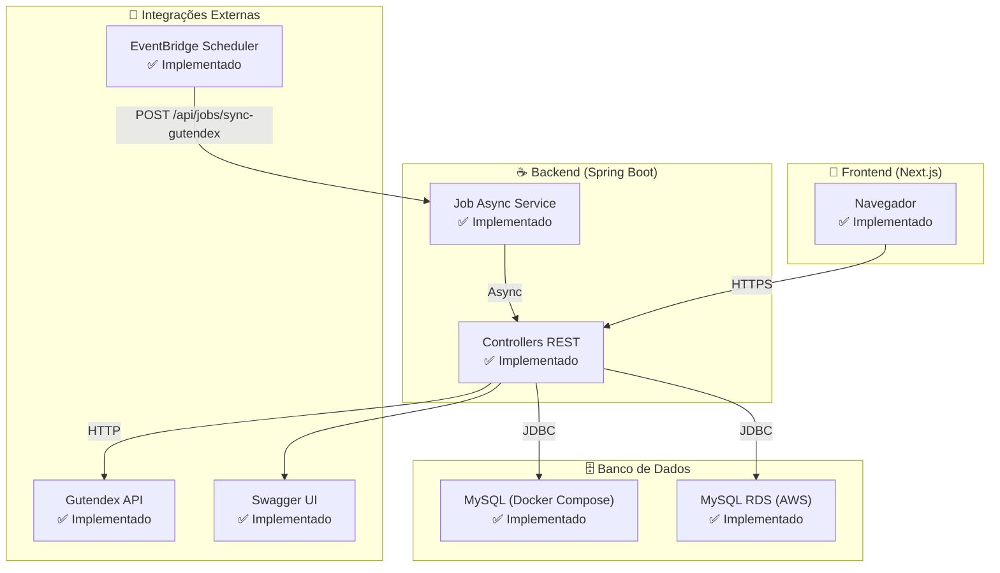
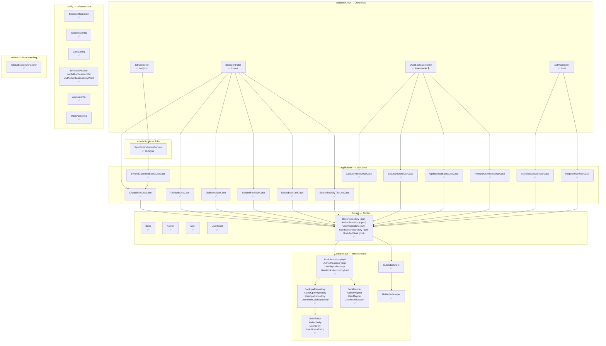
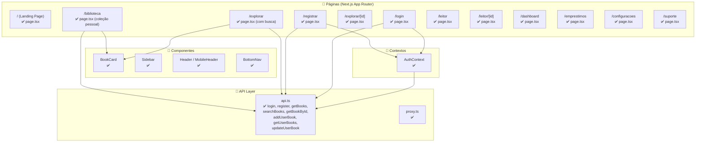

# 🏗️ C4 Model — Alexandria

> **Legenda:** ✅ Implementado | 🔧 Parcialmente implementado | 📋 Plano (não implementado)

---

## Nível 1 — Context (System Context)

---

## Nível 2 — Container

---

## Nível 3 — Component (Backend)

---

## Nível 3 — Component (Frontend)

---

## 📋 Planos (Não Implementados)

### 🔮 Autenticação Seletiva
**Arquivo:** `markdown/plano_autenticacao_seletiva.md`

| Endpoint | Hoje | Plano |
|---|---|---|
| `GET /books/**` | ✅ Público | ✅ Público (mantém) |
| `POST /books` | ✅ Público | 🔒 **Autenticado** |
| `PUT /books/{id}` | ✅ Público | 🔒 **Autenticado** |
| `DELETE /books/{id}` | ✅ Público | 🔒 **Autenticado** |
| `POST /api/jobs/sync-gutendex` | ✅ Público | 🔑 **API Key** |
| `/user-books/**` | 🔒 Autenticado | 🔒 Autenticado (mantém) |

---

### 🔮 Flyway em Produção (pós-MVP)
| O que | Status |
|---|---|
| Migrations V0, V001, V002 | ✅ Código pronto |
| Flyway ativo no RDS | 📋 **Aguardando pós-MVP** |
| Migration V003 (schema atual) | 📋 **Precisa ser criada** |

---

## ✅ Resumo Geral

| Componente | Implementado | Em Plano |
|---|---|---|
| **Backend** — Domain, Application, Adapters | ✅ 100% | — |
| **Backend** — Controllers REST | ✅ 4 controllers | — |
| **Backend** — Security (JWT) | ✅ | 🔒 Reforçar escrita |
| **Backend** — Job Sincronização | ✅ | — |
| **Backend** — Flyway | ✅ Migrações | 📋 Ativar pós-MVP |
| **Backend** — Swagger | ✅ | Ajustes finos |
| **Backend** — Testes | ✅ 237 testes | — |
| **Frontend** — Páginas | ✅ 12 páginas | — |
| **Frontend** — API integration | ✅ | — |
| **Infra** — Docker (local) | ✅ | — |
| **Infra** — Docker (AWS) | ✅ | — |
| **Infra** — Kubernetes | ✅ | — |
| **Infra** — CI/CD (.github) | ⚠️ Apenas hooks | 📋 GitHub Actions |
| **Infra** — AWS EventBridge | ✅ | — |
