# Plano de Implementação — RBAC com Role e Fechamento de Endpoints

> **Objetivo:** Fechar os endpoints que fazem alterações (criar/editar/deletar livros, sincronizar Gutendex)
> para que apenas usuários com role `ADMIN` possam usá-los, sem perder os 60k livros já sincronizados.

---

## Estratégia de Migração (Dados Seguros)

### Banco de produção — SQL manual antes do deploy

```sql
ALTER TABLE users ADD COLUMN role VARCHAR(20) NOT NULL DEFAULT 'USER';
UPDATE users SET role = 'ADMIN' WHERE username = 'talitateste';
```

- `ALTER TABLE` é instantâneo — tabela com 60k livros intacta
- `DEFAULT 'USER'` garante que todos os usuários existentes recebem role USER
- `UPDATE` promove o admin específico
- Depois do SQL, basta subir a nova versão da aplicação — Hibernate valida que a coluna existe e segue normalmente

### Passo a passo — ALTER TABLE na produção

**Infraestrutura (dados do `deploy-backend-only.sh`):**

| Item | Valor |
|------|-------|
| RDS Endpoint | `alexandria-db.c9qs2asg26uk.us-east-2.rds.amazonaws.com` |
| Porta | `3306` |
| Database | `alexandriadb` |
| Usuário RDS | `admin` |
| Senha RDS | `wBBLmV5dZkaYqB5` |
| EC2 (bastion) | `ec2-3-138-110-168.us-east-2.compute.amazonaws.com` |
| Chave SSH | `ec2-login.pem` |

**Opção 1 — Via EC2 (recomendado):**

```bash
# 1. Conecta na EC2
ssh -i ~/.ssh/ec2-login.pem ec2-user@ec2-3-138-110-168.us-east-2.compute.amazonaws.com

# 2. (Dentro da EC2) Instala MySQL client se não tiver
sudo yum install -y mysql

# 3. Conecta no RDS
mysql -h alexandria-db.c9qs2asg26uk.us-east-2.rds.amazonaws.com \
      -P 3306 -u admin -p

# 4. Dentro do MySQL:
USE alexandriadb;
ALTER TABLE users ADD COLUMN role VARCHAR(20) NOT NULL DEFAULT 'USER';
UPDATE users SET role = 'ADMIN' WHERE username = 'talitateste';

# 5. Verifica
SELECT id, username, role FROM users;
EXIT;
```

**Opção 2 — Via Docker (sem instalar MySQL client na EC2):**

```bash
ssh -i ~/.ssh/ec2-login.pem ec2-user@...
docker run --rm -it mysql:8.0 mysql -h alexandria-db... -P 3306 -u admin -p
# (mesmos comandos SQL acima)
```

**⏱️ Tempo estimado:** `ALTER TABLE` < 1 segundo (metadata-only). `UPDATE` instantâneo (1 linha). **Zero risco para os 60k livros.**

**🔐 Antes de executar (opcional, mas recomendado):**
```bash
# Backup de segurança da tabela users (leva segundos)
mysqldump -h alexandria-db... -u admin -p alexandriadb users > backup_users.sql
```

### Ambiente de testes (H2 em memória)

- `ddl-auto=create-drop` no profile de teste → Hibernate **cria a coluna automaticamente**
- Nenhuma migração manual necessária nos testes

---

## Arquivos a Modificar

### Domínio

| Arquivo | Mudança |
|---------|---------|
| `domain/user/User.java` | Adicionar `enum Role { USER, ADMIN }` + campo `role` nos construtores/factory methods |

### Adapter — Persistência

| Arquivo | Mudança |
|---------|---------|
| `adapter/out/persistence/entity/UserEntity.java` | Adicionar `@Enumerated(EnumType.STRING) private Role role` com default |
| `adapter/out/persistence/mapper/UserMapper.java` | Mapear `role` nos dois sentidos |

### Adapter — Segurança

| Arquivo | Mudança |
|---------|---------|
| `config/jwt/JwtTokenProvider.java` | `generateToken` receber `role` como parâmetro; adicionar `getRoleFromToken` |
| `config/jwt/JwtAuthenticationFilter.java` | Extrair `role` do token, setar como `authority` no `UsernamePasswordAuthenticationToken` |
| `config/SecurityConfig.java` | Restringir endpoints: GET público, POST/PUT/DELETE `/books` e `/api/jobs` só ADMIN |

### Application — Auth

| Arquivo | Mudança |
|---------|---------|
| `application/auth/dto/AuthOutput.java` | Adicionar campo `String role` no record |
| `application/auth/AuthenticateUserUseCase.java` | Preencher `role` com `user.getRole().name()` |
| `application/auth/GoogleAuthUseCase.java` | Preencher `role` no `Output` (sempre "USER") |

### Adapter — REST

| Arquivo | Mudança |
|---------|---------|
| `adapter/in/rest/auth/AuthController.java` | Passar `role` ao chamar `jwtTokenProvider.generateToken()` |
| `adapter/in/rest/auth/dto/AuthResponse.java` | Adicionar campo `role` no record + mapear no `from()` |

---

## Testes a Modificar

### 1. `domain/user/UserTest.java` — Testar role

- `shouldCreateUser()`: verificar `user.getRole() == Role.USER`
- `shouldRestoreUser()`: verificar role preservada
- `shouldUpdateUser()`: verificar que `updateWith` preserva a role
- `shouldCreateUserWithAdminRole()`: provar que todo create gera USER (ou criar helper se quiser)

### 2. `adapter/out/persistence/entity/UserEntityTest.java`

- Testar que o construtor com role funciona
- Testar que o default é `Role.USER`

### 3. `adapter/out/persistence/mapper/UserMapperTest.java`

- Mapear role nos dois sentidos (entity → domain e domain → entity)

### 4. `config/jwt/JwtTokenProviderTest.java`

- `shouldGenerateTokenWithRole()`: verificar claim "role"
- `shouldExtractRoleFromToken()`: roundtrip
- Atualizar chamadas existentes de `generateToken` para incluir role

### 5. `config/jwt/JwtAuthenticationFilterTest.java`

- `shouldSetAuthenticationWithAdminRoleAuthority()`: verificar `getAuthorities()` contém `ROLE_ADMIN`
- `shouldSetAuthenticationWithUserRoleAuthority()`: verificar `ROLE_USER`

### 6. `application/auth/AuthenticateUserUseCaseTest.java`

- `shouldAuthenticateValidUser()`: verificar `output.role() == "USER"`
- Adicionar `userId` no `User.restore()` nos mocks (já tem)

### 7. `adapter/in/rest/AuthControllerIntegrationTest.java`

- `shouldLoginUser()`: mock retornar `AuthOutput.of(null, 1L, "john_doe", "USER")`
- `shouldRegisterUser()`: não mexe (RegisterOutput não muda)

### 8. `adapter/in/rest/BookControllerIntegrationTest.java` — **NOVOS TESTES**

- `shouldCreateBookAsAdmin()`: com token de admin → 204
- `shouldNotCreateBookAsUser()`: com token de user → 403
- `shouldNotCreateBookWithoutToken()`: sem token → 401 (ou 403, depende da config)
- `shouldNotUpdateBookAsUser()`: PUT com token user → 403
- `shouldNotDeleteBookAsUser()`: DELETE com token user → 403
- `shouldGetBookWithoutToken()`: GET público mantém → 200

### 9. `adapter/in/rest/JobControllerIntegrationTest.java` — **NOVOS TESTES**

- `shouldSyncAsAdmin()`: token admin → 202
- `shouldNotSyncAsUser()`: token user → 403
- `shouldNotSyncWithoutToken()`: sem token → 401

### 10. `adapter/in/rest/ProfileControllerIntegrationTest.java`

- Mock do `getRoleFromToken` nos testes existentes (para não quebrar)
- Atualizar `profile/me` para retornar role

### 11. `adapter/in/rest/UserBooksControllerIntegrationTest.java`

- Substituir `contextLoads()` por testes reais de autorização:
  - GET /user-books com token → 200
  - GET /user-books sem token → 401

---

## Checklist de Implementação

- [ ] **Domínio:** `User.java` — enum e campo role
- [ ] **Entidade JPA:** `UserEntity.java` — coluna role
- [ ] **Mapper:** `UserMapper.java` — mapear role
- [ ] **Teste unitário:** `UserTest.java` — role em create/restore/update
- [ ] **Teste unitário:** `UserEntityTest.java` — role default
- [ ] **Teste unitário:** `UserMapperTest.java` — mapeamento role
- [ ] **JWT:** `JwtTokenProvider.java` — role nas claims
- [ ] **Teste unitário:** `JwtTokenProviderTest.java` — claims de role
- [ ] **Filter:** `JwtAuthenticationFilter.java` — authorities apartir da role
- [ ] **Teste unitário:** `JwtAuthenticationFilterTest.java` — authorities corretas
- [ ] **DTO:** `AuthOutput.java` — campo role
- [ ] **Use Case:** `AuthenticateUserUseCase.java` — retornar role
- [ ] **Teste unitário:** `AuthenticateUserUseCaseTest.java` — assert role
- [ ] **Use Case:** `GoogleAuthUseCase.java` — retornar role
- [ ] **Controller:** `AuthController.java` — passar role no token
- [ ] **DTO:** `AuthResponse.java` — expor role na resposta
- [ ] **Config:** `SecurityConfig.java` — fechar endpoints por HTTP method + role
- [ ] **Teste integração:** `AuthControllerIntegrationTest.java` — mock com role
- [ ] **Teste integração:** `BookControllerIntegrationTest.java` — testes de 403
- [ ] **Teste integração:** `JobControllerIntegrationTest.java` — testes de 403
- [ ] **Teste integração:** `ProfileControllerIntegrationTest.java` — mock de role
- [ ] **Teste integração:** `UserBooksControllerIntegrationTest.java` — testes reais
- [ ] **SQL manual:** `ALTER TABLE` + `UPDATE` no banco de produção
- [ ] **Deploy:** Subir nova versão
- [ ] **Verificação:** Testar fluxos completos (leitura pública, escrita admin-only)

---

## Revisão Final — Gaps Identificados e Fechados

### 🔴 GAP #1: Mudança de assinatura quebra ~16 arquivos de teste

`User.restore()` passa de **7 para 8 parâmetros**, `new UserEntity()` também. Cada local precisa adicionar `Role.USER` como último argumento.

**Arquivos afetados:**
- `UserTest.java` (5 chamadas)
- `UserEntityTest.java` (1 chamada)
- `UserMapperTest.java` (2 chamadas)
- `UserJpaRepositoryTest.java` (4 chamadas)
- `UserBooksJpaRepositoryTest.java` (1 chamada)
- `UserBooksMapperTest.java` (1 chamada)
- `UserBooksEntityTest.java` (1 chamada)
- `AuthenticateUserUseCaseTest.java` (2 chamadas)
- `RegisterUserUseCaseTest.java` (1 chamada)
- `GetProfileUseCaseTest.java` (1 chamada)
- `UpdatePasswordUseCaseTest.java` (3 chamadas)
- `UpdateProfileUseCaseTest.java` (4 chamadas)

**Solução:** Adicionar `User.Role.USER` como último parâmetro em todas. Mudança mecânica, mas precisa ser feita em todos.

### 🔴 GAP #2: Testes de integração vão falhar com 403

`BookControllerIntegrationTest` e `JobControllerIntegrationTest` fazem POST/PUT/DELETE sem autenticação. Depois da restrição, receberão 403.

**Solução:** Usar `@WithMockUser(roles = "ADMIN")` do `spring-security-test` (já disponível no pom.xml).

### 🔴 GAP #3: ProfileControllerIntegrationTest vai dar NullPointerException

Mocka `getUsernameFromToken` e `getUserIdFromToken`, mas `getRoleFromToken()` não está mockado. O filter vai chamar e receber `null`.

**Solução:** Adicionar `when(jwtTokenProvider.getRoleFromToken("valid-token")).thenReturn("USER")`.

### 🟡 GAP #4: AuthControllerIntegrationTest precisa de atualização dupla

1. Mock `generateToken(1L, "john_doe")` → agora é `generateToken(1L, "john_doe", "USER")`
2. Mock `AuthOutput.of(null, 1L, "john_doe")` → agora é `AuthOutput.of(null, 1L, "john_doe", "USER")`
3. Assert da resposta deve incluir `$.role`

### 🟡 GAP #5: AuthResponse agora expõe role

O endpoint de login vai retornar `"role": "USER"` no JSON. Testes de contrato precisam validar.

### ℹ️ GAP #6: UserBooksControllerIntegrationTest está vazio

Apenas `contextLoads()`. Idealmente substituir por testes reais com token e sem token.

---

## Ordem de Implementação (evitando retrabalho)

```mermaid
flowchart LR
    A[1. User.java + UserEntity.java] --> B[2. UserMapper.java]
    B --> C[3. Ajustar ~16 testes quebrados]
    C --> D[4. JwtTokenProvider.java + teste]
    D --> E[5. AuthOutput.java + AuthenticateUserUseCase + GoogleAuthUseCase]
    E --> F[6. AuthResponse.java + AuthController.java + teste]
    F --> G[7. JwtAuthenticationFilter.java + teste]
    G --> H[8. SecurityConfig.java]
    H --> I[9. Atualizar testes Book, Job, Profile, UserBooks]
    I --> J[10. SQL manual produção + build final]
```



- Passos 1-3: todos os testes compilam
- Passo 4-6: auth funciona com role
- Passo 7-8: segurança ativa
- Passo 9: todos os testes passam
- Passo 10: deploy
