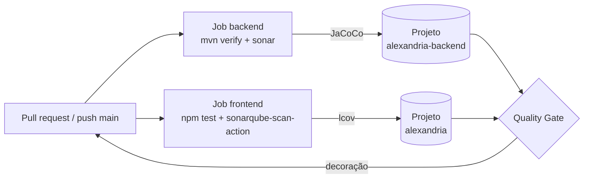

# Qualidade de código com SonarCloud — Relatório de acompanhamento

> Projeto Integrador **Alexandria** · Disciplina de Testes de Software
> Documento vivo: cada intervenção no SonarCloud é registrada na seção
> [Diário de movimentos](#6-diário-de-movimentos), com data, ação e resultado medido.

---

## 1. Por que análise estática faz parte de testes

Testes automatizados (unitários, integração, E2E) verificam **comportamento**: dado
um estímulo, o sistema responde como esperado. A **análise estática** verifica o
**código em si**, sem executá-lo: vulnerabilidades, bugs prováveis, código difícil de
manter, duplicação e cobertura de testes.

As duas se complementam na pirâmide de qualidade:

| Técnica | Pergunta que responde | Ferramenta no Alexandria |
|---|---|---|
| Teste unitário | A função faz o que deveria? | JUnit 5 (backend), Vitest (frontend) |
| Teste E2E | O fluxo do usuário funciona? | Playwright |
| Teste de carga | Aguenta o volume esperado? | k6 (`load-tests/`) |
| **Análise estática** | **O código é seguro, confiável e sustentável?** | **SonarCloud** |

### 1.1 SonarQube x SonarCloud

- **SonarQube**: servidor que a própria equipe instala e mantém.
- **SonarCloud**: a mesma engine oferecida como SaaS, integrada ao GitHub. É a que usamos
  (organização `mba-puc-alexandria`), porque dispensa infraestrutura e é gratuita para
  projetos públicos.

### 1.2 Conceitos usados neste relatório

| Conceito | Significado |
|---|---|
| **Issue** | Violação de uma regra. Tipos: *Bug* (confiabilidade), *Vulnerability* (segurança), *Code Smell* (manutenibilidade). |
| **Severidade** | Blocker › Critical › Major › Minor › Info. |
| **Rating (A–E)** | Nota por dimensão. Em segurança, a nota é dada pela **pior** vulnerabilidade: 1 Critical já leva a nota para **D**. |
| **Security Hotspot** | Trecho sensível que exige revisão humana; não é erro por si só. |
| **New Code** | Código alterado desde a referência (aqui: *previous version*, 31/07/2026). |
| **Quality Gate** | Conjunto de condições que aprova ou reprova a análise. Avalia **apenas o New Code** — a estratégia *Clean as You Code*. |

O ponto central de *Clean as You Code*: não é preciso zerar a dívida técnica histórica
para ter o Gate verde. Basta **não introduzir problemas novos**. A dívida antiga é
tratada de forma planejada, sem bloquear entregas.

---

## 2. Como a análise está configurada

Workflow: `.github/workflows/sonar-scan-alexandria.yaml`, disparado em *push* para
`main` e em todo *pull request*.



| Job | Projeto no SonarCloud | Cobertura |
|---|---|---|
| Backend (Java 17, Maven) | `mba-puc-alexandria_alexandria-backend` | JaCoCo |
| Frontend (Next.js, TypeScript) | `mba-puc-alexandria_alexandria` | Vitest → `coverage/lcov.info` |

---

## 3. Cenário encontrado — 18/09/2026

Última análise: 22/08/2026, commit `9df313e` (merge do PR #76, `feature/iac`, na `main`).
Dados coletados pela API pública do SonarCloud.

### 3.1 Quality Gate: **REPROVADO**

| Condição (New Code) | Limite | Obtido | Status |
|---|---|---|---|
| Security Rating | A | **D** | ❌ |
| Reliability Rating | A | A | ✅ |
| Maintainability Rating | A | A | ✅ |
| Linhas duplicadas | ≤ 3% | 0,0% | ✅ |
| Hotspots revisados | 100% | 100% | ✅ |

**Uma única condição reprova o Gate: segurança do código novo.**

### 3.2 Panorama geral (código total)

| Métrica | Valor |
|---|---|
| Linhas de código analisadas | 4.322 |
| Vulnerabilidades | 6 (Security Rating **D**) |
| Bugs | 4 (Reliability Rating **C**) |
| Code Smells | 53 (Maintainability Rating **A**) |
| Duplicação | 0,8% |
| Severidades | 2 Critical · 48 Major · 13 Minor |

### 3.3 Vulnerabilidades no New Code (causa da reprovação)

| # | Sev. | Arquivo | Regra | Problema |
|---|---|---|---|---|
| V1 | **CRITICAL** | `iac/ecs/alb.tf:39` | terraform:S4423 | Listener HTTPS usa `ELBSecurityPolicy-2016-08`, que aceita TLS 1.0/1.1 |
| V2 | MAJOR | `iac/ecs/alb.tf:1` | terraform:S6258 | ALB sem `access_logs`: trilha de auditoria incompleta |
| V3 | MAJOR | `iac/ecs/monitoring.tf:3` | terraform:S6413 | Logs do CloudWatch retidos por só 7 dias |
| V4 | MAJOR | `sonar-scan-alexandria.yaml:65` | githubactions:S7637 | Action referenciada por tag (`@v5`), não por SHA |
| V5 | MAJOR | `sonar-scan-alexandria.yaml:58` | githubactions:S8543 | Dependências JavaScript sem versão travada/verificada |

**V1 sozinha determina a nota D.** As demais, se ficarem sozinhas, ainda seguram a nota
em C (Major), portanto também precisam ser tratadas.

### 3.4 Dívida anterior (não bloqueia o Gate)

| Tipo | Arquivo | Regra | Problema |
|---|---|---|---|
| Vuln. | `alexandria-frontend/Dockerfile:7` | docker:S6505 | `npm ci` sem `--ignore-scripts` executa scripts de instalação de terceiros |
| Bug | `LoginModal.tsx:67` e `:75` | typescript:S1082 | Elemento com `onClick` sem suporte a teclado (acessibilidade) |
| Bug | `eslint.config.mjs:18` | javascript:S905 | Expressão sem efeito |
| Bug | `V002__Create_Authors_And_BookAuthors.sql:18` | plsql:NullComparison | Comparação `= NULL` em vez de `IS NULL` |

Code Smells mais frequentes:

| Regra | Qtd. | Descrição |
|---|---|---|
| typescript:S9011 | 26 | `<button>` sem `type` explícito dentro de `<form>` |
| typescript:S6759 | 10 | Props de componentes React não marcadas como `readonly` |
| typescript:S6671 | 5 | `Promise.reject` com literal em vez de `Error` |
| typescript:S6853 | 2 | `<label>` sem controle associado |
| typescript:S6848 | 2 | Elemento não interativo com handler de clique |

### 3.5 Problemas de configuração detectados

| # | Problema | Evidência | Impacto |
|---|---|---|---|
| C1 | Projeto do backend não existe no SonarCloud | API: *"Component key `mba-puc-alexandria_alexandria-backend` not found"* | Job do backend falha; o Java não está sendo analisado |
| C2 | *Automatic Analysis* provavelmente ativa em paralelo ao CI | O projeto `alexandria` contém issues de `iac/` e `alexandria-backend/`, fora do `projectBaseDir` do job frontend | Análises concorrentes; o scan via CI costuma falhar com *"You are running CI analysis while Automatic Analysis is enabled"*; a cobertura do Vitest não chega ao painel |

---

## 4. Plano de ação

Prioridade pelo impacto no Gate: primeiro o que reprova, depois o que sustenta a
reprovação, por fim a dívida.

| Prioridade | Item | Providência | Tipo |
|---|---|---|---|
| **P0** | V1 | Trocar `ssl_policy` por `ELBSecurityPolicy-TLS13-1-2-2021-06` (só TLS 1.2 e 1.3) | Código |
| **P0** | C2 | Desligar *Automatic Analysis* (*Administration → Analysis Method*) | Configuração |
| **P0** | C1 | Criar o projeto `mba-puc-alexandria_alexandria-backend` na organização | Configuração |
| P1 | V4 | Fixar todas as actions do workflow por SHA de commit, com a tag em comentário | Código |
| P1 | V5 | Fixar `setup-node` por SHA e ativar o cache do npm ligado ao `package-lock.json` | Código (hipótese — ver 4.1) |
| P1 | V3 | Aumentar a retenção dos logs para 30 dias | Código |
| P1 | V2 | Decidir: ativar `access_logs` (bucket S3 + policy) **ou** aceitar o risco com justificativa | Decisão da equipe |
| P2 | Dockerfile | `npm ci --ignore-scripts` no estágio de dependências | Código |
| P3 | Bugs e Code Smells | Correção incremental; S9011 (26 ocorrências) tem correção mecânica | Código |

### 4.1 Critérios para cada tipo de issue

| Situação | Ação no SonarCloud |
|---|---|
| Problema real | Corrigir no código; a issue fecha sozinha na próxima análise |
| Risco conhecido e aceito | *Accept*, com justificativa escrita |
| Regra não se aplica ao contexto | *False positive*, com justificativa |
| Security Hotspot | *Review* → *Safe* ou *Fix* |
| Pasta fora do escopo | `sonar.exclusions` (decisão registrada neste documento) |

Evitar `// NOSONAR`: silencia o alerta sem deixar registro da decisão.

A correção de V5 é uma **hipótese**: a descrição da regra S8543 aponta dependências
JavaScript sem versão verificada. A validação é a próxima análise — se a issue
continuar aberta, o item volta para investigação.

### 4.2 Prevenção

- **SonarQube for IDE** (antigo SonarLint) no VS Code/IntelliJ, em *connected mode* com
  a organização: mostra as mesmas regras enquanto o código é escrito.
- **Decoração de PR**: o SonarCloud comenta no pull request; merge somente com Gate verde.
- **Cobertura no New Code**: depois de C2 resolvido, incluir `new_coverage ≥ 80%` no Gate.

---

## 5. Métricas de acompanhamento

| Data | Gate | Segurança | Confiabilidade | Manutenibilidade | Vulns | Bugs | Smells | Observação |
|---|---|---|---|---|---|---|---|---|
| 22/08/2026 | ❌ | D | C | A | 6 | 4 | 53 | Linha de base (commit `9df313e`) |

---

## 6. Diário de movimentos

### 18/09/2026 — Diagnóstico inicial

- Levantamento via API do SonarCloud (`qualitygates/project_status`, `issues/search`,
  `measures/component`).
- Identificada a causa da reprovação: V1 (TLS antigo no ALB).
- Identificados C1 (projeto do backend inexistente) e C2 (análise automática concorrente).
- Plano de ação da seção 4 definido.

### 18/09/2026 — Correções no código (fase 1)

| Item | Branch | Arquivo | Mudança |
|---|---|---|---|
| V1 | `fix/sonar-quality-gate` (a partir da `main`) | `iac/ecs/alb.tf` | `ssl_policy`: `ELBSecurityPolicy-2016-08` → `ELBSecurityPolicy-TLS13-1-2-2021-06` |
| V3 | `fix/sonar-quality-gate` | `iac/ecs/monitoring.tf` | `retention_in_days`: 7 → 30 |
| V4 | `feature/001-saas-pagamentos` | `sonar-scan-alexandria.yaml` | `checkout`, `setup-java`, `cache` e `setup-node` fixados por SHA, com a versão em comentário |
| V5 | `feature/001-saas-pagamentos` | `sonar-scan-alexandria.yaml` | `setup-node` com `cache: npm` e `cache-dependency-path` no `package-lock.json` (hipótese) |
| Dockerfile | `feature/001-saas-pagamentos` | `alexandria-frontend/Dockerfile` | `npm ci --ignore-scripts` |

Verificação local:

- Imagem do frontend reconstruída **sem cache** com `--ignore-scripts`: build concluído com
  sucesso, logo nenhuma dependência precisa dos scripts de instalação.
- Terraform não está instalado na máquina; `terraform validate` fica para o pipeline de IaC.
- A política `ELBSecurityPolicy-TLS13-1-2-2021-06` recusa clientes que só falam TLS 1.0/1.1.
  Navegadores atuais não são afetados.

**Pendências manuais no painel do SonarCloud** (exigem permissão de administrador da organização):

1. C2 — *Project `alexandria` → Administration → Analysis Method* → desligar *Automatic Analysis*.
2. C1 — *Analyze new project* → criar `mba-puc-alexandria_alexandria-backend`.
3. V2 — a equipe decide entre ativar `access_logs` (bucket S3 + policy de escrita do ELB) ou
   marcar a issue como *Accept*, com justificativa (custo em ambiente acadêmico).

**Resultado esperado na próxima análise da `main`:** V1, V3, V4 e o Dockerfile fechados;
Security Rating do New Code sobe de D para C enquanto V2 (Major) estiver aberta, e para A
quando V2 for corrigida ou aceita e a hipótese de V5 se confirmar. O Gate só fica verde com A.
Os valores reais entram na tabela da seção 5.

### 18/09/2026 — Incidente no pipeline: "Java 17 is not supported"

**Sintoma** (run `35407518529`, job `105800236415`):

```
[ERROR] Java 17 is not supported. Please upgrade to Java 21 or newer, or use JRE auto-provisioning.
[ERROR] Failed to execute goal org.sonarsource.scanner.maven:sonar-maven-plugin:5.1.0.4751:sonar
```

**Causa raiz:** o scanner do SonarCloud passou a exigir Java 21 para rodar. O workflow tinha
`-Dsonar.scanner.skipJreProvisioning=true`, que impede o scanner de baixar o próprio JRE e o
obriga a usar o JDK 17 instalado no runner.

**Correção:** remover `skipJreProvisioning` dos dois jobs. O scanner baixa um JRE 21 só para ele,
e o backend continua compilando com Java 17 (`<java.version>17</java.version>` no `pom.xml`).
O passo "Set up JDK 17 for SonarCloud" do job frontend também saiu: a `sonarqube-scan-action`
já provisiona o JRE de que precisa.

**Lição para a apresentação:** a ferramenta de análise é uma dependência do pipeline como
qualquer outra. Travar a versão (SHA) protege contra mudanças inesperadas no código da action,
mas não contra requisitos novos do serviço — por isso o JRE deve ficar a cargo do scanner.

### 18/09/2026 — Correções no código (fase 2: dívida anterior)

| Regra | Qtd. | Correção |
|---|---|---|
| S9011 `<button>` sem `type` | 31 | `type="button"` em todos os botões sem tipo; nenhum estava dentro de `<form>`, então o comportamento não muda |
| S6759 props mutáveis | 10 | Props dos componentes envolvidas em `Readonly<...>` |
| S6671 rejeição sem `Error` | 5 | `epub-cache.ts`: `reject(x.error ?? new Error(...))` — o erro do IndexedDB pode ser `null` |
| S1082 / S6848 clique sem teclado | 4 | `LoginModal`: o overlay virou `<button>` nativo; o card não precisa mais de `stopPropagation` |
| S6853 label sem controle | 2 | `LoginModal`: `htmlFor` + `id` em usuário e senha |
| S6481 valor do Context recriado | 1 | `AuthModalContext`: `value` com `useMemo` |
| S6479 índice como `key` | 1 | `suporte`: `key={faq.question}` |
| S7721 função no escopo interno | 1 | `explorar`: `handleSearch` movida para fora do componente |
| S7765 `.some()` por igualdade | 1 | `proxy.ts`: `AUTH_PATHS.includes(pathname)` |
| S905 expressão sem efeito | 1 | `src/eslint.config.mjs` removido: cópia não usada do `eslint.config.mjs` da raiz |

Verificação: `tsc` sem erros novos, `eslint src` com 0 erros (igual à linha de base) e build de
produção do frontend concluído. Os testes Vitest rodam no CI (`npm test`).

**Ficaram de fora, com motivo:**

| Item | Motivo | Ação |
|---|---|---|
| `V002__Create_Authors_And_BookAuthors.sql:18` (`= NULL`) | Migration Flyway já aplicada: alterar o arquivo muda o checksum e quebra a inicialização de todos os ambientes | Corrigir numa migration nova, se a lógica estiver errada, e marcar esta issue como *Accept* |
| `sanity.test.ts` (asserção sempre verdadeira) | Arquivo só existe na `main` | Remover ou trocar por um teste real na `main` |
| S2004 (aninhamento no leitor), S3358 (ternário aninhado), S6772 (espaçamento JSX) | Exigem refatoração de componentes grandes; baixo risco | Próxima fase |
